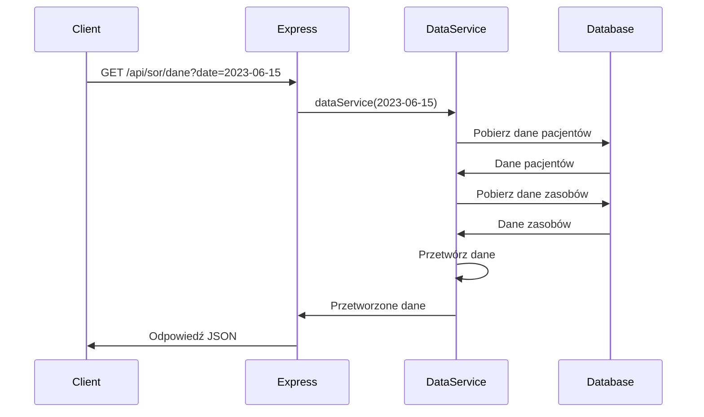

# Dokumentacja Serwera Express dla Systemu Obsługi SOR (Szpitalnego Oddziału Ratunkowego)

## Spis treści

1. Wprowadzenie
2. Struktura projektu
3. Konfiguracja
4. Endpointy API
5. Modele danych
6. Usługi (Services)
7. Middleware
8. Obsługa błędów
9. Logowanie
10. Bezpieczeństwo
11. Testowanie
12. Deployment
13. Diagramy sekwencyjne
14. Przykłady użycia API
15. Opis procesu rozwoju (Development Workflow)
16. Słownik terminów

## 1. Wprowadzenie

Ten serwer Express jest kluczową częścią systemu zarządzania Szpitalnym Oddziałem Ratunkowym (SOR). 
Głównym celem projektu jest dostarczenie narzędzi do efektywnego monitorowania i zarządzania 
pacjentami, zasobami ludzkimi oraz infrastrukturą SOR. Serwer obsługuje wszystkie operacje związane z 
danymi pacjentów, zarządzaniem personelem medycznym i dostępnymi łóżkami, a także umożliwia śledzenie 
kolejek i stanu zasobów w czasie rzeczywistym.

## 2. Struktura projektu

Projekt został zorganizowany w następującej strukturze katalogów:

```
server/
│
├── config/
│   ├── database.js
│   └── dummy_records_generator.js
│
├── middleware/
│   └── validation.js
│
├── routes/
│   └── sor.js
│
├── services/
│   ├── dataService.js
│   ├── defaultValues.js
│   └── sor.js
│
├── utils/
│   └── logger.js
│
├── .gitignore
├── client.js
├── doc.md
├── index.js
├── package.json
└── package-lock.json
```

Struktura ta zapewnia czytelny i modularny podział odpowiedzialności w aplikacji. Główne składniki to:

- **config**: Zawiera pliki konfiguracyjne, takie jak połączenie z bazą danych.
- **middleware**: Przechowuje middleware, np. funkcje walidacyjne.
- **routes**: Definiuje punkty końcowe (endpointy) API.
- **services**: Implementuje logikę biznesową i operacje na danych.
- **utils**: Zawiera ogólne narzędzia, takie jak moduł loggera.

## 3. Konfiguracja

### Baza danych (config/database.js)

Projekt używa MySQL jako bazy danych. Połączenie jest konfigurowane za pomocą zmiennych środowiskowych:

```javascript
export async function createTCPConnection() {
  return mysql.createConnection(process.env.MYSQL_URL);
}
```

### Zmienne środowiskowe (.env)

Projekt korzysta z pliku `.env` do konfiguracji zmiennych środowiskowych. Oto przykładowa konfiguracja (z fikcyjnymi danymi):

```
MYSQLHOST=db.example.com
MYSQLPORT=3306
MYSQLUSER=sor_user
MYSQLPASSWORD=example_password_123
MYSQL_DATABASE=sor_database
R_URL=https://r-service.example.com/predict
```

Objaśnienie zmiennych:
- `MYSQLHOST`: Adres hosta bazy danych MySQL
- `MYSQLPORT`: Port, na którym nasłuchuje baza danych MySQL
- `MYSQLUSER`: Nazwa użytkownika do bazy danych MySQL
- `MYSQLPASSWORD`: Hasło do bazy danych MySQL
- `MYSQL_DATABASE`: Nazwa bazy danych MySQL
- `R_URL`: URL do serwisu R używanego do przewidywania liczby pacjentów

**Ważne:** 
1. Upewnij się, że plik `.env` jest dodany do `.gitignore`, aby uniknąć przypadkowego upublicznienia wrażliwych danych.
2. Nigdy nie udostępniaj rzeczywistych danych dostępowych w dokumentacji lub repozytorium kodu.
3. W środowisku produkcyjnym używaj silnych, unikalnych haseł i ogranicz dostęp do minimum niezbędnego dla działania aplikacji.

## 4. Endpointy API

### 4.1. SOR Router (routes/sor.js)

#### GET /api/stan-zasobow

Endpoint ten zwraca stan zasobów dla określonego dnia.

**Parametry zapytania:**

- `date` (wymagane): Data w formacie YYYY-MM-DD, dla której mają zostać pobrane dane.

**Przykładowa odpowiedź:**

```json
[
  {
    "id": 1,
    "ostatnia_aktualizacja": "2023-06-15 08:00:00",
    "ilosc_lekarzy": 5,
    "ilosc_pielegniarek": 10,
    "ilosc_lozek": 20,
    "ilosc_lozek_obserwacji": 5
  },
  {
    "id": 2,
    "ostatnia_aktualizacja": "2023-06-15 09:00:00",
    "ilosc_lekarzy": 6,
    "ilosc_pielegniarek": 11,
    "ilosc_lozek": 19,
    "ilosc_lozek_obserwacji": 4
  }
  // ... więcej rekordów
]
```

#### GET /api/pacjenci

Endpoint ten zwraca listę pacjentów przyjętych w określonym dniu wraz z informacjami o ich typie.

**Parametry zapytania:**

- `date` (wymagane): Data w formacie YYYY-MM-DD, dla której mają zostać pobrani pacjenci.

**Przykładowa odpowiedź:**

```json
[
  {
    "id": 1,
    "data_przyjecia": "2023-06-15 10:30:00",
    "typ": 1,
    "nazwa": "Pilny",
    "czas_lekarza": 30,
    "czas_pielegniarki": 20,
    "czas_lozka": 120,
    "czas_lozka_obserwacji": 60
  },
  {
    "id": 2,
    "data_przyjecia": "2023-06-15 11:15:00",
    "typ": 2,
    "nazwa": "Stabilny",
    "czas_lekarza": 20,
    "czas_pielegniarki": 15,
    "czas_lozka": 90,
    "czas_lozka_obserwacji": 0
  }
  // ... więcej pacjentów
]
```

#### POST /api/stan-zasobow

Endpoint ten służy do dodawania nowego stanu zasobów.

**Przykładowe body żądania:**

```json
{
  "ostatnia_aktualizacja": "2023-06-15 12:00:00",
  "ilosc_lekarzy": 7,
  "ilosc_pielegniarek": 12,
  "ilosc_lozek": 18,
  "ilosc_lozek_obserwacji": 5
}
```

**Odpowiedź:**

```json
{
  "message": "Stan zasobów dodany",
  "id": 3
}
```

#### POST /api/pacjenci

Endpoint ten służy do dodawania nowego pacjenta.

**Przykładowe body żądania:**

```json
{
  "data_przyjecia": "2023-06-15 13:45:00",
  "typ": 1
}
```

**Odpowiedź:**

```json
{
  "message": "Pacjent dodany",
  "id": 3
}
```

#### GET /api/hourly-data

Endpoint ten zwraca dane godzinowe o stanie zasobów dla wybranego dnia oraz dane z ostatniej godziny poprzedniego dnia.

**Parametry zapytania:**

- `date` (wymagane): Data w formacie YYYY-MM-DD, dla której mają zostać pobrane dane.

**Przykładowa odpowiedź:**

```json
{
  "daneGodzinowe": [
    {
      "godzina": "0-1",
      "liczbaPacjentow": 5,
      "zasoby": {
        "liczbaLekarzy": 2,
        "liczbaPielegniarek": 3,
        "liczbaLozek": 10,
        "liczbaLozekObserwacyjnych": 2
      }
    },
    // ... dane dla kolejnych godzin
  ],
  "czasZasobuNaPacjenta": [
    {
      "rodzajPacjenta": "Triage",
      "lekarz": 5,
      "pielegniarka": 10,
      "lozko": 0,
      "lozkoObserwacyjne": 0
    },
    // ... dane dla innych typów pacjentów
  ],
  "statystykaChorych": {
    "Triage": 0.2,
    "Resuscytacja": 0.05,
    // ... statystyki dla innych typów pacjentów
  },
  "kolejka": {
    "lekarz": 30,
    "pielegniarka": 15
  },
  "sredniaWazonaCzasuZasobow": {
    "lekarz": 25,
    "pielegniarka": 20,
    "lozko": 120,
    "lozkoObserwacyjne": 60
  }
}
```

#### Endpointy (nieaktywne)

Następujące endpointy są zdefiniowane w kodzie, ale obecnie nie są używane w głównej funkcjonalności aplikacji:

- GET /api/stan-zasobow
- GET /api/pacjenci
- POST /api/stan-zasobow
- POST /api/pacjenci
- GET /api/hourly-data
- POST /api/stan-kolejki

Szczegółowe informacje o tych endpointach można znaleźć w kodzie źródłowym.

## 5. Modele danych

Aplikacja używa następujących tabel w bazie danych:

### Tabela: typy_pacjenta

- `id`: int unsigned (Klucz główny)
- `nazwa`: varchar(48)
- `czas_lekarza`: double
- `czas_pielegniarki`: double
- `czas_lozka`: double
- `czas_lozka_obserwacji`: double

Tabela ta przechowuje informacje o różnych typach pacjentów, takich jak czas pobytu u lekarza, 
pielęgniarki, czas zajmowania łóżka oraz czas obserwacji.

### Tabela: pacjenci

- `id`: int unsigned (Klucz główny)
- `data_przyjecia`: datetime
- `typ`: int unsigned (Klucz obcy do typy_pacjenta.id)

Tabela ta zawiera informacje o pacjentach przyjętych do SOR, w tym datę przyjęcia i typ pacjenta.

### Tabela: stan_zasobow

- `id`: int unsigned (Klucz główny)
- `ostatnia_aktualizacja`: datetime
- `ilosc_lekarzy`: int unsigned
- `ilosc_pielegniarek`: int unsigned
- `ilosc_lozek`: int unsigned
- `ilosc_lozek_obserwacji`: int unsigned

Tabela ta przechowuje informacje o bieżącym stanie zasobów w SOR, takich jak liczba lekarzy, 
pielęgniarek, łóżek i łóżek obserwacyjnych.

### Tabela: stan_kolejki

- `id`: int unsigned (Klucz główny)
- `data`: datetime
- `minuty_lekarz`: int
- `minuty_pielegniarka`: int

Tabela ta zawiera informacje o kolejkach do lekarza i pielęgniarki w danym dniu.

## 6. Usługi (Services)

### dataService.js

Ten serwis zawiera główną logikę biznesową dla endpointu `/dane`. Obsługuje on:
- Pobieranie i przetwarzanie danych pacjentów
- Obliczanie statystyk pacjentów
- Generowanie danych godzinowych
- Obliczanie średnich ważonych czasu zasobów
- Obsługę prognozowania dla przyszłych dat

### defaultValues.js

Zawiera domyślne wartości używane w aplikacji, takie jak:
- Dane o lekarzach i pielęgniarkach
- Domyślne statystyki pacjentów
- Domyślne czasy zasobów na pacjenta
- Rozkłady pacjentów w ciągu dnia dla różnych dni tygodnia

### sor.js

#### getHourlyData(date)

Funkcja ta pobiera godzinowe dane o stanie zasobów dla wybranego dnia oraz dane z ostatniej 
godziny poprzedniego dnia. Korzysta z zapytań SQL do tabel `stan_zasobow` i `stan_kolejki`, aby 
uzyskać potrzebne informacje.

#### addStanKolejki(stanKolejki)

Funkcja ta dodaje lub aktualizuje stan kolejki dla danego dnia w tabeli `stan_kolejki`. 
Używa zapytania SQL z klauzulą `ON DUPLICATE KEY UPDATE`, aby zoptymalizować operację.

## 7. Middleware

### validation.js

Plik ten zawiera funkcje walidacyjne dla różnych endpointów, np. `validatePacjent` do walidacji 
danych pacjenta przed dodaniem do bazy.

## 8. Obsługa błędów

W głównym pliku `index.js` zdefiniowany jest middleware do obsługi błędów:

```javascript
app.use((err, req, res, next) => {
  logger.error(err.stack);
  res.status(500).send('Coś poszło nie tak!');
});
```

Wszystkie błędy wychwycone w aplikacji są logowane za pomocą modułu loggera, a następnie zwracana 
jest ogólna odpowiedź z kodem 500 (Błąd serwera).

## 9. Logowanie

Projekt używa biblioteki Winston do logowania. Konfiguracja znajduje się w `utils/logger.js`. 
Logging jest konfigurowalny za pomocą zmiennej środowiskowej `LOG_LEVEL`.

## 10. Bezpieczeństwo

- Używane są zmienne środowiskowe do przechowywania wrażliwych danych, takich jak dane do połączenia z bazą danych.
- Stosowana jest walidacja danych wejściowych za pomocą middleware, aby zapobiec atakom typu injection.
- Używane są parametryzowane zapytania SQL, aby zapobiec atakom SQL Injection.

## 11. Testowanie

(Tu należy dodać informacje o testach jednostkowych i integracyjnych, jeśli są implementowane)

## 12. Deployment

Serwer może być uruchomiony lokalnie za pomocą polecenia:

```
node index.js
```

Dla środowiska produkcyjnego zaleca się użycie menedżera procesów, takiego jak PM2:

```
pm2 start index.js --name "sor-server"
```

## 13. Diagramy sekwencyjne

Poniżej przedstawiono przykładowy diagram sekwencyjny dla endpointu `/api/sor/dane`:



Ten diagram ilustruje sekwencję wydarzeń dla endpointu `/api/sor/dane`. 
Klient inicjuje żądanie, które jest obsługiwane przez warstwę Express. 
Express przekazuje żądanie do DataService, który pobiera niezbędne dane z bazy danych, 
przetwarza je i zwraca do Express, który z kolei wysyła odpowiedź do klienta.

## 14. Przykłady użycia API

### 14.1. Pobieranie danych z endpointu /dane

#### cURL:

```bash
curl -X GET "http://localhost:8080/api/sor/dane?date=2023-06-15"
```

#### JavaScript (fetch):

```javascript
fetch('http://localhost:8080/api/sor/dane?date=2023-06-15')
  .then(response => response.json())
  .then(data => console.log(data))
  .catch(error => console.error('Error:', error));
```

## 15. Opis procesu rozwoju (Development Workflow)

### 15.1. Konwencje nazewnictwa

- **Pliki**: Używaj snake_case, np. `stan_zasobow.js`.
- **Zmienne i funkcje**: Używaj camelCase, np. `getHourlyData`.
- **Klasy**: Używaj PascalCase, np. `StanZasobow`.
- **Stałe**: Używaj UPPER_CASE, np. `MAX_PACJENTOW`.

### 15.2. Proces code review

1. Stwórz nową gałąź dla swojej funkcjonalności: `git checkout -b feature/nowa-funkcjonalnosc`
2. Wprowadź zmiany i commituj regularnie.
3. Po zakończeniu pracy, wypchnij zmiany na zdalne repozytorium: `git push origin feature/nowa-funkcjonalnosc`
4. Utwórz Pull Request (PR) w systemie kontroli wersji (np. GitHub, GitLab).
5. Przypisz co najmniej jednego recenzenta do PR.
6. Recenzent przegląda kod i zostawia komentarze lub sugestie zmian.
7. Wprowadź niezbędne poprawki i odpowiedz na komentarze.
8. Po zatwierdzeniu przez recenzenta, PR może zostać scalony z główną gałęzią.

### 15.3. Tworzenie Pull Requestów

1. Upewnij się, że Twój kod jest zgodny z konwencjami projektu.
2. Napisz jasny i zwięzły opis PR, wyjaśniając wprowadzone zmiany.
3. Jeśli PR rozwiązuje konkretny problem, odnieś się do numeru issue.
4. Dodaj odpowiednie etykiety do PR (np. "feature", "bugfix", "documentation").
5. Jeśli PR wprowadza zmiany w API, zaktualizuj dokumentację.
6. Upewnij się, że wszystkie testy przechodzą pomyślnie.

## 16. Słownik terminów

- **SOR**: Szpitalny Oddział Ratunkowy
- **Triage**: System segregacji pacjentów według stopnia pilności udzielenia pomocy medycznej
- **Stan zasobów**: Aktualny stan dostępności personelu medycznego i łóżek w SOR
- **Typ pacjenta**: Klasyfikacja pacjenta określająca przewidywany czas i rodzaj potrzebnej opieki
- **Kolejka**: Lista pacjentów oczekujących na konsultację lekarską lub pielęgniarską
- **Endpoint**: Punkt końcowy API, adres URL do którego można wysłać żądanie
- **Middleware**: Oprogramowanie pośredniczące, które przetwarza żądania przed ich obsługą przez właściwy handler
- **ORM**: Object-Relational Mapping, technika mapowania obiektów na relacyjne bazy danych
- **JWT**: JSON Web Token, standard bezpiecznego przesyłania informacji między stronami jako obiekt JSON
- **CRUD**: Create, Read, Update, Delete - podstawowe operacje na danych

---
